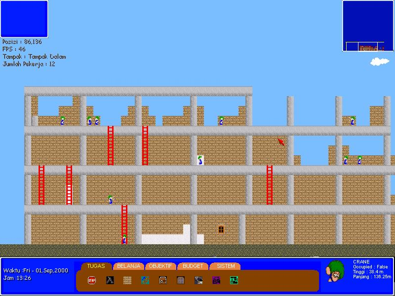



## Build The Tower \(UPDATED, English Version\)

### Description

This is kind of game where u build a tower using worker (i am using lemmings type worker).. sorry some of graphics i just got it from internet.. hope they dont mind.. please vote for it.. and tell me what you guys think.

Press A for new worker, and other please refer to help menu inside the games. Already translate it to English Version.. enjoy it
 
### More Info
 

             |
---                |---
**Submitted On**   |2004-09-15 21:11:28
**By**             |[Imam Gunawan](https://github.com/Planet-Source-Code/PSCIndex/blob/master/ByAuthor/imam-gunawan.md)
**Level**          |Advanced
**User Rating**    |5.0 (40 globes from 8 users)
**Compatibility**  |VB 5\.0, VB 6\.0
**Category**       |[DirectX](https://github.com/Planet-Source-Code/PSCIndex/blob/master/ByCategory/directx__1-44.md)
**World**          |[Visual Basic](https://github.com/Planet-Source-Code/PSCIndex/blob/master/ByWorld/visual-basic.md)
**Archive File**   |[Build\_The\_1794239152004\.zip](https://github.com/Planet-Source-Code/imam-gunawan-build-the-tower-updated-english-version__1-56171/archive/master.zip)

